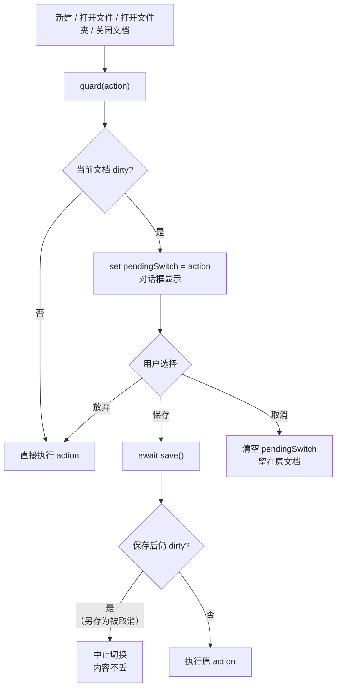
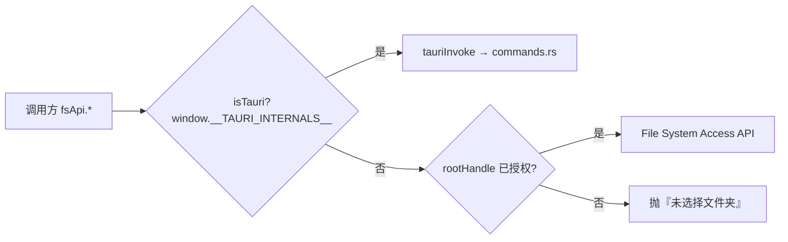
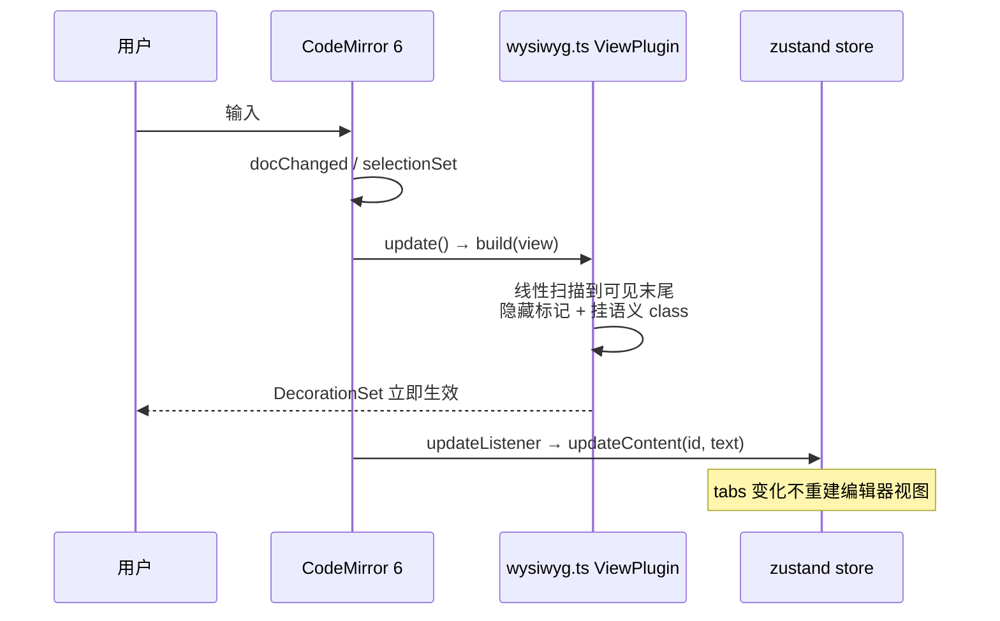
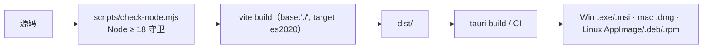
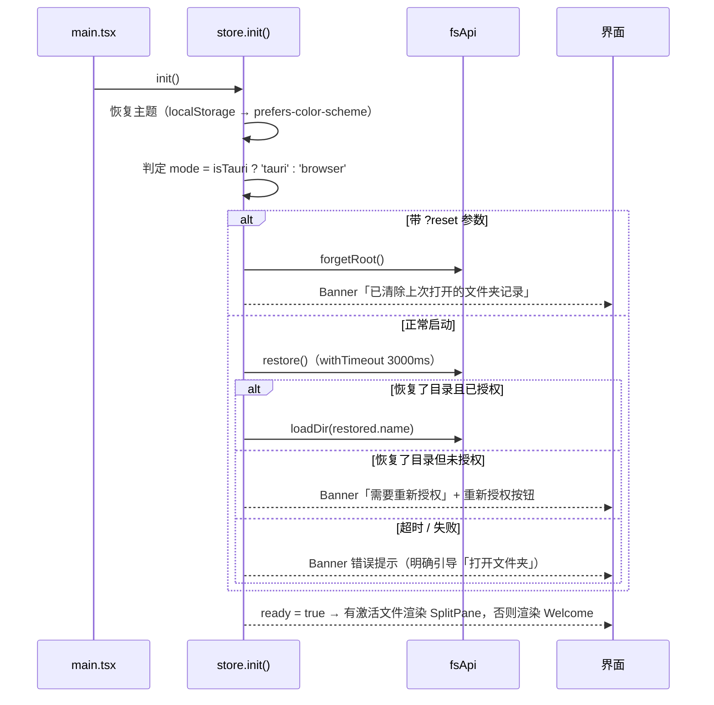

# Kore 项目设计文档

> **Kore** · 极速 · 本地 · 开源的 Markdown 编辑器
>
> 本文档描述 Kore 的产品定位、整体架构、关键模块设计、数据流与运行约束，
> 作为后续开发、重构与交接的**唯一架构基准**。

| 项 | 值 |
| --- | --- |
| 版本 | v0.3.5 |
| 仓库 | https://github.com/renxf0319/kore.git |
| 前端根目录 | `E:\WorkBuddy\2026-10-01-13-16-44\kore` |
| 文档状态 | 基于当前代码库实测整理，与实现一致 |
| 适用读者 | 项目维护者、参与二次开发的同学 |

> **v0.3.5 变更摘要**：左侧栏右缘新增**可拖拽竖线**自由调宽（持久化 + 双击复位）；
> 「文件/大纲」页签改回 Typora 的**按内容宽度居中**排法（不再平分整行），标签线加粗到 3px。
>
> **v0.3.4 变更摘要**：排版模型改为 Typora 的「左固定留白」（弃用 max-width 居中）；
> 侧栏收窄到 196px；「文件/大纲」页签平分并占满整行；空态（无工作区 / 无标题）上下居中；
> **打开已有文件时不再自动聚焦**，编辑区不显示光标（点击后才出现）。
>
> **v0.3.3 变更摘要**：对齐 Typora 的三处交互 —— ①侧栏「文件/大纲」页签加宽、
> 字体与菜单栏协调；②启动即进入空白未命名文档（不再显示欢迎页）；③侧栏空态只留
> 「打开文件夹」按钮，去掉所有说明文字。
>
> **v0.3.2 变更摘要**：修复**桌面端文件树里所有子目录都被误判为文件、无法展开**的 bug
> （Rust `is_dir` 与 TS `isDir` 字段名不匹配 —— 见 §5.8，这个坑很隐蔽）。
>
> **v0.3.1 变更摘要**：修掉「刚打开文档时首行标题露出 `#`」的 bug；
> 底部栏去掉文档名（单文档下是冗余），当前文件改为在左侧文件树高亮。
>
> **v0.3.0 变更摘要**：改为**单文档模式** —— 去掉多标签，点其他文件直接覆盖，
> 覆盖前若上一个文档未保存则弹「保存 / 放弃 / 取消」；侧栏显隐按钮移到**底部栏左下角**，
> 隐藏时不再显示侧栏把手小竖条；菜单栏右上角不再显示「Kore — 文件夹名」。
> 详见 §5.0.5 与 §12。

---

## 1. 产品定位与设计目标

### 1.1 一句话定位

一个**只活在用户本机**的 Markdown 写作工具：左边写、右边即时渲染，文件永远落在用户选的目录里。

### 1.2 设计目标（优先级从高到低）

| 优先级 | 目标 | 落地体现 |
| --- | --- | --- |
| P0 | **零云同步** | 架构中不存在任何网络层后端；`fsApi` 只有本地读写通道 |
| P0 | **启动快、输入不卡** | Markdown 解析放 Web Worker；CodeMirror 6 取代 Monaco；Tauri 取代 Electron |
| P0 | **体积可控** | 安装包 2~3MB（Tauri + 系统 WebView） |
| P1 | **双形态同一套代码** | 桌面端（Tauri，Rust 读盘）/ 浏览器端（File System Access API），上层无感知 |
| P1 | **不静默失败** | 任何文件操作异常都经 `Banner` 显式呈现；错误文案做了中文映射 |
| P2 | **界面克制** | 单色系 + 少量强调色，左右中缝可拖，无多余面板 |

### 1.3 明确不做的事（Non-Goals）

- 不做云同步 / 多端协作 / 账号体系 —— 这是产品底线，不是待办。
- 不做富文本 WYSIWYG，编辑体验锚定 Markdown 源码。
- 不做插件系统（当前版本）。
- 不做客户端自动更新（发版靠 GitHub Actions 打 tag 出包）。

---

## 2. 总体架构

### 2.1 分层视图


### 2.2 关键架构决策（ADR 摘要）

| # | 决策 | 理由 | 被否决的方案 |
| --- | --- | --- | --- |
| ADR-1 | 用 **Tauri 2 + Rust** 而非 Electron | 安装包 2~3MB、内存低、复用系统 WebView、原生文件权限模型清晰 | Electron（体积大、冷启动慢） |
| ADR-2 | 用 **CodeMirror 6** 而非 Monaco / TinyMCE | 体积约为 Monaco 的 1/5，扩展模型（Compartment）完美适配主题切换，自带搜索/多光标/缩进 | Monaco（过重） |
| ADR-3 | Markdown 解析跑在 **Web Worker**，且主线程只持有一份预览 HTML | 大文档不卡主线程，输入不丢帧 | 主线程同步渲染（大文档掉帧） |
| ADR-4 | 文件系统访问收敛到 **单一 `fsApi` 门面**，双模式同签名 | 业务代码零环境判断，`isTauri` 只在 `fs.ts` 与状态层出现两次 | 各组件自行判断运行环境 |
| ADR-5 | 状态用 **zustand 单 store**，不做 Context + reducer | 样板极少、选择器订阅可精准重渲染；跨组件（MenuBar/Sidebar/DocBar/StatusBar）共享同一份数据 | Redux Toolkit（样板重） |
| ADR-6 | 预览渲染链路固定为 **Worker 渲染 → DOMPurify 消毒 → `dangerouslySetInnerHTML`** | 即使 `markdown-it` 开了 `html: true`，出口仍强制消毒，杜绝注入面 | 直接 innerHTML |
| ADR-7 | 双形态同一份前端产物（`base: './'`），Tauri 只做宿主 | 免维护两套 UI | 前端按平台分仓 |

---

## 3. 技术选型

| 层 | 选型 | 版本 | 理由 |
| --- | --- | --- | --- |
| 桌面运行时 | Tauri 2（Rust） | 2.x | 见 ADR-1 |
| UI 框架 | React | 18.3 | 生态最成熟 |
| 语言 | TypeScript（strict + noUnusedLocals/Parameters） | 5.6 | 类型安全，`tsc --noEmit` 进 build |
| 构建 | Vite | 5.4 | HMR 极快；`worker.format: 'es'` 支持 ES Module Worker |
| 编辑器 | CodeMirror 6（state/view/commands/lang-markdown/search/lint/theme-one-dark） | 6.x | 见 ADR-2 |
| Markdown | markdown-it（html / linkify / typographer） | 14 | 插件生态齐全 |
| 扩展 | markdown-it-anchor / task-lists / footnote | 9 / 2 / 4 | 标题锚点、任务列表、脚注 |
| 代码高亮 | highlight.js | 11 | 语言覆盖广 |
| 消毒 | DOMPurify | 3.1 | 导出/打印出口统一净化（见 ADR-6） |
| 状态 | zustand | 4.5 | 见 ADR-5 |
| 图标 | lucide-react | 0.451 | 线性一致 |
| 样式 | 纯 CSS + CSS 变量（`tokens.css`） | - | 零运行时、主题切换只换 `[data-theme]` |
| 工具链约束 | Node ≥ 18（`.node-version` = 22.23.3，fnm 固定） | - | Vite 5 不支持 Node 16 |

> v0.2.0 起 `markdown-it` / `highlight.js` / `DOMPurify` **只用于导出与打印**，
> 屏幕上的所见即所得由 `src/lib/wysiwyg.ts` 的 CodeMirror 装饰实现，不依赖这三者。

---

## 4. 目录结构

```
kore/
├── index.html                  # 唯一 HTML 入口（#root + module script）
├── vite.config.ts              # base:'./' 适配 Tauri 自定义协议；worker.format:'es'
├── tsconfig.json / .node-version
├── dev.cmd                     # 仓库根一键启动（窗口管理器双击即可）
├── scripts/
│   ├── check-node.mjs          # Node 版本前置守卫（<18 直接退 1，给出明确提示）
│   ├── dev.cmd / dev-desktop.cmd / dev-desktop.ps1
│   ├── install-rust.ps1        # 交互式安装 Rust，默认落非 C 盘
│   ├── gen_logo.py             # 从品牌源图生成 logo 与全套应用图标
│   └── push-to-github.ps1
├── src/
│   ├── main.tsx                # initTheme() → createRoot，加载 tokens.css / global.css
│   ├── assets/                 # logo 四件套（mark/wordmark × light/dark）
│   ├── components/
│   │   ├── App.tsx             # 骨架：MenuBar / Banner / Sidebar / Editor / DocBar / StatusBar / ConfirmSwitch
│   │   ├── MenuBar.tsx         # 一级菜单（文件、主题）+ 导出子菜单
│   │   ├── Sidebar.tsx         # 左侧栏容器：文件/大纲页签（显隐按钮不在这里）
│   │   ├── FileTree.tsx        # 「文件」页签：工作区目录树
│   │   ├── DocBar.tsx          # 底部单文档栏（左下角=侧栏显隐；中间=文档名+未保存圆点）
│   │   ├── ConfirmSwitch.tsx    # 未保存拦截对话框（保存 / 放弃 / 取消）
│   │   ├── Editor.tsx          # CodeMirror 宿主 + 大纲跳转
│   │   ├── Welcome.tsx         # 欢迎页（新建 / 打开文件 / 打开文件夹）
│   │   ├── Banner.tsx          # 顶部提示条（含「重新授权」按钮）
│   │   └── StatusBar.tsx
│   ├── state/store.ts          # 唯一的 zustand store（全部业务动作）
│   ├── lib/
│   │   ├── wysiwyg.ts          # ★ Typora 风格装饰引擎（核心，约 400 行）
│   │   ├── fs.ts               # 双模文件系统桥
│   │   ├── markdown.ts         # Worker 桥 + 过期请求丢弃（仅导出/打印用）
│   │   ├── export.ts           # 导出 HTML / PDF（按需渲染 + 消毒）
│   │   ├── outline.ts / slug.ts / theme.ts / logo.ts / types.ts
│   ├── workers/markdown.worker.ts   # markdown-it + hljs（仅导出/打印用）
│   ├── styles/tokens.css       # 亮/暗双主题 CSS 变量
│   └── styles/global.css       # 布局 + Markdown 语义样式 + @media print
├── src-tauri/
│   ├── Cargo.toml              # release profile：lto + panic=abort + strip + opt-level="s"
│   ├── tauri.conf.json         # productName Kore / identifier com.kore.app / Windows 1200×800
│   ├── capabilities/default.json
│   └── src/{main.rs,lib.rs,commands.rs}
├── dist/                       # Tauri 消费的静态产物（frontendDist: ../dist）
└── .github/workflows/release.yml  # push v* 标签 → 三平台安装包 → GitHub Release
```

> v0.1.0 里的 `Preview.tsx` / `SplitPane.tsx` / `Toolbar.tsx` / `Outline.tsx`
> 已在 v0.2.0 删除（分屏预览与工具栏按钮条都不再需要）。

---

## 5. 关键模块设计

### 5.0 v0.2.0 架构调整（先读这一节）

#### 5.0.1 三处结构性变化

| 变化 | v0.1.0 | v0.2.0 | 原因 |
| --- | --- | --- | --- |
| 编辑体验 | 左右分屏，左源码右预览 | **单栏 WYSIWYG**，直接显示 md 样式且可编辑 | Typora 风格；分屏在窄屏上把正文压得太窄 |
| 打开文件 | 必须先 `openFolder()` 才能编辑 | **新建文档直接写**，保存时再选路径 | 「打开」一个文件却被迫先选工作区是反直觉的 |
| 导航结构 | 顶部工具栏按钮 + 右侧大纲 | **一级菜单**（文件/主题）+ 左侧「文件/大纲」页签 + 底部单文档栏 | Typora 风格，且工具栏在窄屏放不下 7 个按钮 |

#### 5.0.2 WYSIWYG 为什么用「装饰」而不是「富文本」

实现所见即所得有两条路：

| 方案 | 做法 | 取舍 |
| --- | --- | --- |
| 富文本（ProseMirror/TipTap） | 文档换成富文本 DOM，Markdown 只是导入导出格式 | 需要维护「富文本 ↔ Markdown」双向序列化，**这是 bug 温床**（光标跳、列表塌陷、粘贴丢格式） |
| **装饰（当前采用）** | CodeMirror 继续编辑**纯 Markdown 源码**，只是把标记藏起来、把样式挂上去 | 文档始终是合法 Markdown，导出/复制/另存为零成本；代价是「所见」是假的，只对行级/行内标记有效（表格、脚注仍不会渲染成富文本） |

核心模块是 `src/lib/wysiwyg.ts`（约 400 行），关键设计：

1. **只编辑源码，永不反序列化** —— 标记隐藏靠 `Decoration.replace({})`（零宽替换），
   语义样式靠 `Decoration.mark` / `Decoration.line`。
2. **光标所在行不隐藏标记** —— Typora 的核心行为：光标落哪行，哪行就临时显示 `#`、`**`、`- `，
   用户随时能看见并编辑原始语法（`ctx.cursorLine`）。
3. **围栏是跨行状态，所以线性扫描而非只扫视口** —— 若只扫 `visibleRanges`，
   围栏开头在视口上方时会把代码块内容当普通段落解析。实测代价可接受（万行文档 < 1ms）。
4. **行内规则会嵌套命中，必须去重** —— `**粗**` 里的 `*` 也会命中斜体规则。
   用 `claimed: [from, to][]` 记录已占用区间，重叠的命中直接跳过。
5. **两个已踩过的坑（改这个文件前务必知道）**：
   - `view.visibleRanges` 在 **ViewPlugin 构造阶段为空数组**，直接取 `[length-1]` 会抛
     `Cannot read properties of undefined (reading 'to')`，而 CodeMirror 只会打印一行
     `CodeMirror plugin crashed`，极难定位。必须兜底成 `state.doc.lines`。
   - 装饰必须按 `from` 升序加入，乱序会抛 `Ranges must be added sorted`。
     因此统一收集到数组后交给 `Decoration.set(list, true)` 排序，**不要手工用 `RangeSetBuilder`**。

#### 5.0.3 CSS 权重陷阱

`global.css` 里所有 Markdown 语义样式都必须写成 `.editor-host .cm-md-*`（权重 0,2,0），
不能只写 `.cm-md-*`（0,1,0）—— 否则会被同样作用于 `.cm-line` 的
`.editor-host .cm-line { padding: 0 }`（0,2,0）整条盖掉，
表现为**列表缩进和圆点静默消失**（不报错，只是看不见）。这个坑真实发生过。

#### 5.0.4 无工作区也能写

- `OpenTab.path` 允许为 `null`（未命名文档），标签用稳定的 `id` 作 key —— 这是本次把
  `active` 从「path」改成「id」的根本原因。
- `save()` 检测到 `path === null` 时自动转入 `saveAs()`，用户无需先想好存哪。
- 浏览器端另存为靠 `showSaveFilePicker` 返回的 `FileSystemFileHandle` 存进 `fs.ts` 的
  `looseFiles: Map`，**后续保存必须复用同一个句柄** —— 浏览器不允许凭路径字符串重新拿句柄。
- 桌面端保存路径是绝对路径；浏览器端没有绝对路径，虚拟路径就是文件名本身。

#### 5.0.5 v0.3.0：单文档模式与未保存拦截

需求是「不支持同时多个标签页，点其他文件直接覆盖，上一个未保存则提示」。落地时拆成三块：

**1. 单文档不变量**

`tabs` 数组**恒为 0 或 1 个元素**。保留数组结构（而不是换成单个 `doc` 字段）是为了让
`Editor` / `StatusBar` / `FileTree` 的取值逻辑不必大改，但**不要再往里 push 第二个文档**。
所有赋值都走 `single(doc | null)` 这个辅助函数，它是唯一允许写 `tabs` 的地方。

**2. `guard(action)` —— 统一的切换入口**



两个容易写错的点：

- **「保存」后必须复查 dirty**：用户在另存为对话框点了取消时，`save()` 什么都没做但也没报错。
  若不检查就继续切换，等于「点了保存却丢了内容」——这比不弹框更糟。
- **拦截必须发生在读文件之后**：先 `readFile` 成功再 `guard`，
  免得用户先选完文件才发现上一个文档有未保存内容。若读取失败则不弹框（没什么可切换的）。

`openFile` 另有一条短路：点当前正打开的同一文件直接返回，**不弹未保存提示**——
否则用户点自己正在编辑的文件会被无意义地拦一次。

**3. 侧栏显隐只有一个入口**

按钮放在**底部栏左下角**（`DocBar`），侧栏页签行右侧不再有折叠箭头，
隐藏时也**不显示任何把手小竖条**（原 `SidebarHandle` 已删除）。
`setPane()` 相应改为「只切页签、顺带确保侧栏可见」，不再做「再点一次当前页签 = 折叠」
的隐式折叠 —— 那会形成两个控制入口，用户不知道该点哪个。

#### 5.0.6 v0.3.1：两处交互修正

**1. 「刚打开文档时首行标题露出 `#`」**

现象：打开 md 后首行 H1 显示成 `# 标题`，在正文任意位置点一下就恢复正常。

根因：`Editor.tsx` 打开文档时调 `view.focus()`，光标落在**位置 0**；
而 `wysiwyg.ts` 判断「哪一行露原始标记」只看 `selection.main.head` 所在行，
于是第 1 行（恰好常是标题行）被当成光标行。**「刚打开」和「用户把光标放进去」
在 position 0 上无法区分**，这是问题的本质。

修法：把判定从「光标在哪行」改成 `activeLine(view)`，三个条件全满足才露标记：

```ts
function activeLine(view: EditorView): number {
  if (!view.hasFocus) return -1                    // ① 编辑器没焦点
  const head = view.state.selection.main.head
  if (head === 0 && view.state.selection.main.empty) return -1  // ② 刚打开
  return view.state.doc.lineAt(head).number        // ③ 用户确实动过
}
```

配套改动：**ViewPlugin 的重算条件必须加 `focusChanged`**。
原先只有 `docChanged / selectionSet / viewportChanged`，
点进文件树再点回编辑器时光标没动，装饰不会重算，「哪一行露标记」就滞后了。
这个坑很隐蔽 —— 功能看起来是好的，只是焦点切换时不更新。

**2. 底部栏去掉文档标签**

单文档模式下底部再显示文档名/未保存圆点是冗余信息（状态栏已有保存状态）。
`DocBar` 现在只留左下角的侧栏显隐按钮；「关闭文档」挪到文件菜单末尾，避免丢失入口。
当前打开的文件改为在左侧文件树高亮 —— 单文档下这是唯一需要指明「我在编辑哪个」的地方，
所以要比普通 hover 更醒目：左侧 2px 强调色竖条 + 加粗 + 强调色文字 + 浅色底。

### 5.1 文件系统桥 `src/lib/fs.ts`（整个项目最核心的抽象）

这一个文件把「桌面端 Rust 读盘」和「浏览器端 File System Access API」拍成同一组接口，
上层（`store.ts`、组件、`export.ts`）只用 `fsApi`，永远不关心自己在哪个环境。



统一 API：

| 方法 | 桌面端实现 | 浏览器端实现 |
| --- | --- | --- |
| `pickFolder()` | `@tauri-apps/plugin-dialog` 的 `open({directory:true})` | `showDirectoryPicker({mode:'readwrite'})` |
| `listDir(path)` | `invoke('read_dir')` | `handle.entries()` 递归到目标目录 |
| `readFile(path)` | `invoke('read_file')` | `getFileHandle().getFile().text()`；无工作区时查 `looseFiles` |
| `writeFile(path, content)` | `invoke('write_file')` | `createWritable()`；无工作区时查 `looseFiles` |
| `openFile()` | `open()` + `read_file` | `showOpenFilePicker()`，句柄存入 `looseFiles` |
| `saveAs(name)` | `save()` 返回绝对路径 | `showSaveFilePicker()`，句柄存入 `looseFiles` |
| `adoptParentOf(path)` | 记下父目录为工作区 | 空操作（浏览器无此概念） |
| `persistRoot / restore` | `localStorage['kore-root']` | IndexedDB `kv` 对象存储存 `FileSystemDirectoryHandle` |
| `regrant / forgetRoot / hasRestoredHandle` | 空操作 / 清 localStorage | `requestPermission` / 删 IndexedDB 记录 |

#### 5.1.1 浏览器端的「虚拟路径」约定（易错点，务必遵守）

浏览器里**没有真实绝对路径**，因此统一用一条规则：

> 虚拟路径的第一段**永远是根目录的名字**（例如打开 `gateway` 目录，`gateway/技术方案.md`）。
> 解析时 `relParts()` 先把这段根名剥掉，剩下的才是相对段；生成子项时必须重新拼上根名前缀。

`src/lib/fs.ts` 的注释明确记录了这条规则的由来：生成子项时漏掉根名前缀 → 解析时按字符串长度硬切 →
展开子目录报「找不到目录」（对应提交 `d2a64fc fix(fs): 修复浏览器模式展开子目录报『找不到目录』`）。
**任何新增路径拼接逻辑都必须复用 `relParts()`，不要自己 `split('/')`。**

#### 5.1.2 权限恢复与三个逃生口

浏览器安全模型要求「重新授权」必须由**用户手势**触发，所以设计上留了三道兜底：

1. `restore()` 返回 `{ name, granted }`，`granted=false` 时不上报失败，而是交给 `Banner` 渲染一个「重新授权」按钮（`notice.action='regrant'`）。
2. `init()` 里对恢复流程套了 `withTimeout(…, 3000)`：IndexedDB 反序列化句柄卡死时**宁可不恢复也不让页面卡住**。
3. `?reset` 查询参数：`store.init()` 检测到即 `forgetRoot()` 并在 Banner 提示重选目录——当恢复流程把页面拖死、界面都点不动时的最后自救手段。

#### 5.1.3 排序规则一致

- 浏览器端：`localeCompare(name, 'zh')`，目录优先。
- Rust `read_dir`：目录优先，再 `to_lowercase()` 后按名字比较。
两端肉眼结果一致，目录树不会出现「桌面端和浏览器端顺序不同」。

### 5.2 状态层 `src/state/store.ts`

zustand 单 store，是整个应用**唯一数据源**。字段与职责：

| 字段 | 类型 | 说明 |
| --- | --- | --- |
| `theme` | `'light' \| 'dark'` | 主题；切换时同时 `applyTheme()` 写 DOM 与 localStorage |
| `mode` | `'tauri' \| 'browser' \| 'unknown'` | 运行形态，状态栏直接展示「桌面端 / 浏览器端」 |
| `rootPath / rootName` | `string \| null` | 当前根目录（桌面端是绝对路径，浏览器端是虚拟根） |
| `expanded` | `Record<string, boolean>` | 目录树展开态，key 为路径 |
| `dirs` | `Record<string, FileNode[]>` | **按需缓存**的目录列表（懒加载，只在展开时拉取） |
| `tabs` | `OpenTab[]` | **单文档模式：恒为 0 或 1 个元素**。元素为 `{ id, path, name, content, savedContent, dirty }` |
| `active` | `string \| null` | 当前文档的 `id`（**不是 path** —— 未命名文档没有 path） |
| `pendingSwitch` | `(() => void) \| null` | 非 null 时显示未保存确认对话框；存的是「待执行的切换动作」 |
| `previewHtml` | `string` | 已消毒的当前预览 HTML，导出时直接用 |
| `ready` | `boolean` | 启动流程是否结束，决定渲染编辑器还是 Welcome |
| `notice` | `Notice \| null` | 顶部提示条，可带 `action:'regrant'` 渲染成按钮 |

动作：`init / setNotice / regrantRoot / setTheme / toggleTheme / openFolder / loadDir /
toggleExpand / openFile / closeTab / setActive / updateContent / saveActive / newFile / setPreviewHtml`。

设计要点：

- **脏标记由内容比对得出**：`updateContent` 里 `dirty = content !== savedContent`，不做额外记账。
- **错误文案本地化**：`errText()` 把浏览器的英文 `DOMException` 映射为中文（NotFoundError/NotAllowedError/
  SecurityError/TypeMismatchError/QuotaExceededError/AbortError 等共 8 类），因为直接展示 `DOMException` 对用户毫无意义。
- **取消不是错误**：`isAbort()` 判断 `AbortError`，用户在系统目录选择框里点取消时静默返回。
- **关闭标签不拦未保存**：`closeTab` 直接丢弃，不做二次确认（当前版本的有意取舍，见 §8）。
- `newFile()` 用 `untitled.md → untitled-1.md → …` 避开同名，写盘后 `loadDir(root)` 刷新目录再开标签。
- 路径分隔符按环境取：`isTauri ? '\\' : '/'`，保证虚拟路径在浏览器端不被 Windows 反斜杠切乱。

### 5.3 编辑链路（WYSIWYG，无预览面板）



三条稳定性保证：

1. **编辑器视图只按 `[active, theme]` 重建**（`Editor.tsx`）：`updateContent` 会改 `tabs`，但绝不能进依赖数组，
   否则每次按键都重建 CodeMirror 视图 → 光标跳动 + 卡顿。代码注释里明确标注了这条约束。
   主题切换还额外走 `themeCompartment.of(oneDark / [])`。
2. **装饰重算的三个触发条件**（`wysiwyg.ts`）：`docChanged || selectionSet || viewportChanged`。
   `selectionSet` 必须包含 —— 「光标所在行不隐藏标记」是 Typora 的核心行为，
   光标一动就得重算，否则标记显示状态会滞后一行。
3. **图片与复选框用 Widget 而非纯装饰**：
   - `CheckboxWidget` 点击时 `dispatch` 把 `[ ]` 改成 `[x]`（长度相同 → 光标不跳），
     并 `mousedown preventDefault` 避免编辑器抢焦点。
   - `ImageWidget` 的 `ignoreEvent()` 返回 `true`，让点击穿透到图片本身。

> markdown Worker（`src/lib/markdown.ts` + `workers/markdown.worker.ts`）**仍在**，但只服务
> 导出与打印（§5.6），不再参与屏幕渲染 —— 编辑期零 Worker 开销。

### 5.4 大纲与跳转

- `extractOutline()`（`src/lib/outline.ts`）：逐行扫，用 `inFence` 状态机跳过代码块内的 `#`。
  状态机记录围栏字符（``` vs ~~~），避免代码块内出现的另一种围栏被误判为闭合。
  返回**行号 `line`（1 起）**，不再返回可跳转的 DOM 锚点。
- 跳转链路：点击大纲项 → `setJumpLine(line)` → `Editor.tsx` 的 effect 里
  `lineToPos(state, line)` 换算绝对位置 → `dispatch({ selection, effects: EditorView.scrollIntoView(pos, { y: 'start', yMargin: 24 }) })` → 聚焦。
  用**行号**而非 DOM id，是因为 WYSIWYG 下根本不存在锚点元素。
- `slugify()`（`src/lib/slug.ts`）仍然保留，产出的 `id` 只用于导出 HTML（与 `markdown-it-anchor` 对齐）。

### 5.5 主题与视觉

- `tokens.css` 定义两套 CSS 变量（亮色 `--bg #ffffff` / 暗色 `--bg #1b1f27`），切换只改 `document.documentElement.dataset.theme`，零重渲染。
- `theme.ts`：`localStorage['kore-theme']` 优先，未设置时回落 `prefers-color-scheme`。
- Logo 四件套由 `scripts/gen_logo.py` 从品牌源图生成（抠底 → 用 HSV 的 value 分色藏青 #394958 / 青 #209EBB → 连通域切 K 标记 → 出图），
  `logo.ts` 按主题返回 `markSrc/wordmarkSrc`，组件只换 `src`。
- 打印样式：`global.css` 的 `@media print` 把整个 `.app` 隐藏（`display:none !important`），
  只显示 `lib/export.ts` 动态创建的 `#kore-print-root`（内含 Worker 渲染 + 消毒后的 HTML）。
  「导出 PDF」= 渲染 → 注入 `#kore-print-root` → 等两帧 → `window.print()` → 系统打印对话框「另存为 PDF」。

### 5.6 导出

| 方式 | 桌面端 | 浏览器端 |
| --- | --- | --- |
| 导出 HTML | 同名 `.html` **写回源文件同级目录** | `Blob + a[download]` 触发本地下载 |
| 导出 PDF | 渲染 → 注入 `#kore-print-root` → `window.print()` | 同左 |

两条导出路径都走同一个前置：`renderSafe(src)` = **Worker 渲染 markdown-it → DOMPurify 消毒**。
与 v0.1.0 的区别是内容来源从常驻预览面板的 `previewHtml` 改成**按需渲染当前标签的 `content`**，
因此导出内容与屏幕所见严格同源（WYSIWYG 下「所见」不是真 HTML，只有重新渲染才能得到带样式的完整文档）。

`buildHtmlDoc()` 生成自包含单文档：内嵌样式，背景/前景/代码块/引用/表格按当前主题取色，
`.anchor-link`、图片 `max-width:100%`、`h1~h3` 加 `scroll-margin-top`。

### 5.7 桌面端 Rust 侧

三个命令，全部同步阻塞式 IO，无异步、无并发（并发由 WebView 单线程 + 用户操作节奏天然串行）：

| 命令 | 实现 | 失败语义 |
| --- | --- | --- |
| `read_dir(path)` | `fs::read_dir`，跳过 `file_type()` 异常项；目录优先 + 小写名排序 | `Result<Vec<FileEntry>, String>`，错误即中文前缀文案 |
| `read_file(path)` | `fs::read_to_string` | 同上 |
| `write_file(path, contents)` | `fs::write`（覆盖） | 同上 |

- 权限面收敛在 `capabilities/default.json`：`core:default / core:event / core:window / core:app` +
  `core:webview:allow-create-webview-window`（「新建窗口」需要）+ `dialog:default / dialog:allow-open / dialog:allow-save`。
  应用自有命令默认放行，不额外声明。
- `main.rs` 用 `#![cfg_attr(not(debug_assertions), windows_subsystem = "windows")]` 屏蔽 release 窗口控制台。
- `Cargo.toml` release profile：`panic="abort"` + `lto=true` + `codegen-units=1` + `opt-level="s"` + `strip=true`，
  目标是极小的 release 体积（与「安装包 2~3MB」的产品目标对应）。
- `tauri.conf.json` 里 `csp: null` —— 当前未设 CSP（见 §8 技术债）。

### 5.8 构建与发布



- `npm run build` = `tsc --noEmit && vite build`，类型错误直接阻断产物。
- `base: './'`：产物走相对路径，才能被 Tauri 自定义协议加载。
- `worker.format: 'es'`：Markdown Worker 以 ES Module 形式拆包。
- CI（`.github/workflows/release.yml`）：`push: tags: ['v*']` 或手动触发 →
  ubuntu-22.04 / windows-latest / macos-latest 三平台矩阵 → 删掉 `package-lock.json` 后 `npm install`
  （避免单一平台 lock 固化原生 optional 依赖，npm bug #4828）→ `tauri build` → 上传 Release。
- Windows MSVC 目标需要 VS 生成工具提供 `link.exe`（外部环境依赖）；
  `scripts/install-rust.ps1` 只保证 `CARGO_HOME`/`RUSTUP_HOME` 落在非 C 盘。

### 5.9 启动流程



---

## 6. 典型数据流时序

### 6.1 首次打开一个文件夹

```
工具栏「打开文件夹」 → openFolder()
  → fsApi.pickFolder()        桌面：原生对话框 / 浏览器：showDirectoryPicker
  → 设置 rootPath/rootName、expanded[root]=true
  → fsApi.persistRoot()       桌面：localStorage / 浏览器：IndexedDB
  → loadDir(root) → fsApi.listDir() → dirs[root] = FileNode[]
  → Sidebar 渲染根目录节点 + 子节点
```

### 6.2 打开文件 → 编辑 → 保存（单文档）

```
点击文件        → openFile(path, name)
                   → 已是当前文件则直接返回（不弹拦截）
                   → fsApi.readFile() 读成功后 guard()：
                      · 当前文档干净 → 直接覆盖
                      · 当前文档 dirty → 弹「保存 / 放弃 / 取消」
展开目录        → toggleExpand(path) → loadDir(path)（懒加载，按需）
CodeMirror 输入  → updateListener → updateContent(id, text) → dirty 自动置位 + 底部栏出现圆点
Ctrl/Cmd + S    → keymap 'Mod-s' → save() → 无 path 则转 saveAs() → writeFile → dirty=false
关闭文档        → requestClose() → guard() 同上
```

---

## 7. 两种运行模式对比

| 维度 | 桌面端（Tauri） | 浏览器端 |
| --- | --- | --- |
| 选目录 | 原生窗口 `tauri-plugin-dialog` | `showDirectoryPicker()`（Chrome/Edge） |
| 读盘 | Rust `fs::read_to_string` | File System Access API |
| 目录记忆 | `localStorage` | IndexedDB 存 `FileSystemDirectoryHandle` |
| 授权 | 系统级，一次选择长期有效 | 每次新页面需 `queryPermission`，用户手势 `requestPermission` 重新授权 |
| 路径形态 | 真实 Windows 绝对路径（`\`） | 虚拟路径（首段为根名，`/`） |
| 导出 HTML | 直接写回源文件同级 | Blob 下载 |
| 安装包 | 2~3MB 独立程序 | 零安装，`npm run dev` 即开 |
| 缺陷面 | 需 Rust 工具链 + MSVC 链接器 | Safari/Firefox 不支持；刷新页面需重新授权 |

---

## 8. 已知约束与技术债

按「影响面 × 修复成本」排序，供后续迭代参考：

| # | 项 | 现状 | 建议 |
| --- | --- | --- | --- |
| 1 | **无自动保存 / 无崩溃恢复** | 只靠手动 `Mod+S`，进程崩溃即丢草稿 | 可选：写入前把 `savedContent` 快照放 IndexedDB，启动时提示恢复 |
| 2 | **WYSIWYG 覆盖的语法有限** | 标题/粗斜体/删除线/高亮/行内代码/链接/图片/引用/列表/任务/围栏/分割线已支持；**表格、脚注、定义列表、HTML 块仍是源码** | 表格可考虑用 `Decoration.replace` + Widget 渲染成真表格；或在文档里明确标注「复杂块请用导出预览」 |
| 3 | **无 CSP** | `tauri.conf.json` 里 `"csp": null` | 补 CSP 白名单（本机静态资源 + blob:），降低 WebView 注入面 |
| 4 | **目录树不自动刷新** | 外部改动文件后需手动「新建/重开」才可见 | 桌面端可接文件监听，浏览器端只能手动 `loadDir` |
| 5 | **并发/外部写覆盖** | `write_file` 无条件覆盖，无时间戳/版本号校验 | 超小型工具可接受；若要加强，可加 mtime 比对 |
| 6 | **编辑器视图随切文件重建** | 撤销历史（`history()`）不跨文件保留，滚动位置丢失 | 如要跨文件撤销，改为按 `id` 缓存多份 `EditorState` |
| 7 | **装饰引擎线性扫描全文** | 为保证围栏状态正确，每次重算都从第 1 行扫到视口末尾 | 万行内可接受；超大文档可加「围栏状态缓存」或改用增量解析 |
| 8 | **大目录首屏加载** | `dirAt()` 逐层 `getDirectoryHandle`，深目录展开有轻微延迟 | 可接受；若卡顿明显可并行化 |
| 9 | **无移动端适配** | 定宽桌面布局（min 760×560） | 移动端若要做需把左侧栏改为抽屉 |
| 10 | **`package-lock.json` 不跨平台** | CI 里刻意 `rm -f` 后重装 | 已是约定，勿回退 |
| 11 | **多标签已移除** | v0.3.0 按需求改为单文档 | 若要恢复多标签，`tabs` 数组结构与 `guard` 拦截可直接复用（把 `single()` 换成 push 即可） |

---

## 9. 附录 A · 常用命令速查

```cmd
:: 浏览器模式（日常迭代，秒级 HMR）
dev.cmd

:: 桌面端（验证 Rust 命令 / 原生窗口 / 打包前表现）
scripts\dev-desktop.cmd

:: 提交前自查
npm run typecheck      :: 只做类型检查，秒级
npm run build          :: tsc --noEmit + vite build
npm run preview        :: 预览 dist 产物
```

> Windows `cmd` 经典坑：`cd` 不会自动换盘。跨盘时须写 `cd /d E:\WorkBuddy\2026-10-01-13-16-44\kore`，
> 否则会报 `ENOENT ... C:\Users\E\package.json`。这也是项目在仓库根放 `dev.cmd` 的原因。

## 10. 附录 B · 关键文件索引

| 关注点 | 文件 |
| --- | --- |
| **所见即所得装饰引擎**（⚠️ 三个坑见 §5.0.2 与 §5.0.6） | `src/lib/wysiwyg.ts` |
| **Rust→TS 字段名契约**（⚠️ 见 §5.8，编译期不报错） | `src-tauri/src/commands.rs` + `src/lib/fs.ts` |
| **Markdown 语义样式**（⚠️ 权重陷阱见 §5.0.3） | `src/styles/global.css` 的 `.editor-host .cm-md-*` |
| 一级菜单（文件 / 主题 / 导出子菜单） | `src/components/MenuBar.tsx` |
| 左侧栏容器与折叠 | `src/components/Sidebar.tsx` |
| 目录树 | `src/components/FileTree.tsx` |
| **侧栏拖拽调宽**（pointer 事件 + 钳制 + 持久化） | `src/components/SidebarResizer.tsx` |
| 底部栏（仅侧栏显隐按钮） | `src/components/DocBar.tsx` |
| 未保存拦截对话框 | `src/components/ConfirmSwitch.tsx` |
| 文件系统抽象 / 路径规则 / 权限恢复 / 另存为句柄 | `src/lib/fs.ts` |
| 全局状态与全部业务动作 | `src/state/store.ts` |
| 编辑器视图装配（⚠️ 依赖数组约束） | `src/components/Editor.tsx` |
| 大纲提取与行号跳转 | `src/lib/outline.ts` |
| 导出 HTML / PDF（按需渲染 + 消毒 + 打印注入） | `src/lib/export.ts` |
| Worker 桥与过期请求丢弃（仅导出/打印用） | `src/lib/markdown.ts` |
| Markdown 渲染配置（仅导出/打印用） | `src/workers/markdown.worker.ts` |
| 锚点 slug（仅导出 HTML 用，改它前先读 §5.4） | `src/lib/slug.ts` |
| 桌面端三个命令 | `src-tauri/src/commands.rs` |
| 桌面端权限面（含新建窗口 / 保存对话框） | `src-tauri/capabilities/default.json` |
| 体积优化配置 | `src-tauri/Cargo.toml`（release profile） |
| 发布流水线 | `.github/workflows/release.yml` |
| 品牌资源生成 | `scripts/gen_logo.py` |

---

## 11. 快捷键

| 快捷键 | 动作 |
| --- | --- |
| `Ctrl/Cmd + S` | 保存（未命名文档自动转入另存为） |
| `Ctrl/Cmd + Shift + S` | 另存为 |
| `Ctrl/Cmd + N` | 新建文档 |
| `Ctrl/Cmd + F` | 编辑器内搜索（CodeMirror 内置） |
| `Tab` | 缩进（`indentWithTab`） |
| `Esc` | 关闭当前展开的菜单 |

## 12. 改动清单（供 code review 对照）

### v0.3.5

**新增**
- `src/components/SidebarResizer.tsx` —— 侧栏右缘的拖拽把手

**调整**
- `src/state/store.ts` —— 新增 `sidebarW` / `setSidebarW`，钳制 [140,520] + localStorage 持久化
- `src/components/App.tsx` —— 挂载把手，把 `sidebarW` 以内联 style 传给 Sidebar
- `src/components/Sidebar.tsx` —— 接受 `style` prop
- `src/styles/global.css` —— 页签 `flex: 0 0 auto` + 容器 `justify-content: center`
  （**按内容宽度居中**而非平分整行）；`border-bottom` 2px → 3px；
  新增 `.sidebar-resizer` 与 `body.resizing-col`

**拖拽实现的三个要点**（改这个文件前务必知道）：

1. **必须用 pointer 事件 + `setPointerCapture`**，不能用 mousedown/mousemove ——
   指针移出把手后 mousemove 会丢；`setPointerCapture` 让指针划出窗口仍继续响应。
2. **拖动时给 `body` 加 `.resizing-col`**（`user-select:none` + 全局 `cursor: col-resize`）。
   否则鼠标移过快会「失去跟踪」，并误选正文文字。
3. **监听挂在 `window` 上**，不挂在把手元素上 —— 否则 React 重渲染换掉 DOM 节点后监听丢失。

**宽度范围取 [140, 520] 的理由**：小于 140px 中文文件名几乎不可读；
大于 520px 编辑区会比侧栏还窄，主次颠倒。

### v0.3.4

**调整**
- `src/styles/global.css` —— **排版模型换掉**：删掉 `max-width:800px` + `margin:auto`，
  改成 `padding: 0 48px 0 96px` 的左固定留白；侧栏 240px → 196px；
  页签 `flex:1 1 0` 平分占满；`.sidebar-body` 改 flex 纵向容器让空态能真正垂直居中
- `src/components/Sidebar.tsx` —— 大纲空态文案改为「无标题」
- `src/components/Editor.tsx` —— 打开已有文件**不调 `view.focus()`**（光标不显示）；
  仅空文档自动聚焦

**为什么弃用 max-width 居中**：`max-width` + `margin:auto` 让正文起点
**随窗口宽度漂移** —— 1080 宽时起点距编辑区左沿只有 42px（贴边太左），
窗口再窄时又会被挤到中间，视觉上很不稳定。Typora 用的是「左固定留白、
正文顺势排到右边」，起点与窗口宽度无关，观感一致。

**为什么 `.sidebar-body` 必须改 flex**：`.sidebar-empty` 的 `flex:1` 只有在父容器
是 flex 容器时才生效；原来是 block 布局，`flex:1` 完全无效，
所以「上下居中」一开始不生效（实测偏差 12px）。改成 `flex-direction:column` 后偏差为 0。

### v0.3.3

**调整**
- `src/styles/global.css` —— 侧栏页签加宽（`min-width: 4.6em`、等宽对齐、`padding: 9px 0`），
  激活态下划线改用 `--fg`（与 Typora 的黑色下划线一致，原来是强调色）；
  菜单栏触发器加 `font-weight: 400` + `letter-spacing: 0.02em` 与页签协调
  （同为 13px，靠字重 400/500/600 分层，不靠字号跳变）
- `src/state/store.ts` —— 启动时 `set(single(makeBlank()))` 备好空白未命名文档；
  抽出 `makeBlank()` 供 `newDoc` / `requestClose` 复用；
  **关闭最后一个文档后补一个空白文档**，编辑区不退回欢迎页
- `src/components/FileTree.tsx` + `global.css` —— 侧栏空态只保留「打开文件夹」按钮，
  删除「尚未打开工作区」与下方两行说明文字

**设计要点**：页签与菜单栏**同为 13px**，层级靠字重（400 菜单 / 500 页签 / 600 激活页签）
区分。若用字号制造层级，两处字号跳变会显得不协调 —— 这是对齐 Typora 时最容易做错的地方。

### v0.3.2

**修复**
- `src-tauri/src/commands.rs` —— `FileEntry` 加 `#[serde(rename_all = "camelCase")]`（根因）；
  `read_file` 先判目录并返回可读提示
- `src/lib/fs.ts` —— `listDir` 归一化 `isDir ?? is_dir`
- `src/state/store.ts` —— 目录误点时提示「请点击左侧箭头展开」而非抛 os error 5

### v0.3.1

**修复**
- `src/lib/wysiwyg.ts` —— 新增 `activeLine()`，打开文档时不再把首行当光标行；
  ViewPlugin 重算条件补 `focusChanged`

**调整**
- `src/components/DocBar.tsx` —— 只保留侧栏显隐按钮，去掉文档名/未保存圆点/关闭按钮
- `src/components/MenuBar.tsx` —— 文件菜单末尾加「关闭文档」
- `src/styles/global.css` —— `.tree-row.active` 加强（左侧竖条 + 加粗）

### v0.3.0

**新增**
- `src/components/DocBar.tsx` —— 底部单文档栏，左下角为侧栏显隐按钮
- `src/components/ConfirmSwitch.tsx` —— 未保存拦截对话框（保存 / 放弃 / 取消，Esc=取消，Enter=保存）

**重写**
- `src/state/store.ts` —— 单文档不变量（`tabs` 恒 0..1）、新增 `guard` / `pendingSwitch` /
  `requestClose` / `resolveDiscard` / `cancelSwitch`、删除 `setActive` / `closeTab`；
  `setPane` 不再做隐式折叠
- `src/components/Sidebar.tsx`（去掉折叠箭头与 SidebarHandle）、`MenuBar.tsx`（去掉右上角标题）、`App.tsx`

**删除**
- `src/components/Tabs.tsx`（多标签栏）
- `Sidebar.tsx` 中的 `SidebarHandle` 导出（侧栏收起时的小竖条）

### v0.2.0

**新增**
- `src/lib/wysiwyg.ts` —— Typora 风格 WYSIWYG 装饰引擎
- `src/components/MenuBar.tsx` —— 一级菜单
- `src/components/FileTree.tsx` —— 从 Sidebar 拆出的目录树

**重写**
- `src/components/Editor.tsx`（接入 livePreview + 大纲跳转）、`Sidebar.tsx`、`Tabs.tsx`（移到底部）、
  `Welcome.tsx`、`StatusBar.tsx`、`App.tsx`
- `src/state/store.ts`（`active` 改用 id、`path` 可空、新增 `save/saveAs/openFileDialog/pane/sidebarOpen/jumpLine`）
- `src/lib/fs.ts`（新增 `openFile/saveAs/adoptParentOf` 与 `looseFiles` 句柄缓存）
- `src/lib/export.ts`（改为按需渲染 + 打印容器注入）
- `src/lib/outline.ts`（返回行号）、`src/lib/types.ts`
- `src/styles/global.css`（全面重写）、`src/styles/tokens.css`（新增语义色变量）
- `src-tauri/capabilities/default.json`（+ 新建窗口 / 保存对话框权限）

**删除**
- `src/components/Preview.tsx`、`SplitPane.tsx`、`Toolbar.tsx`、`Outline.tsx`
