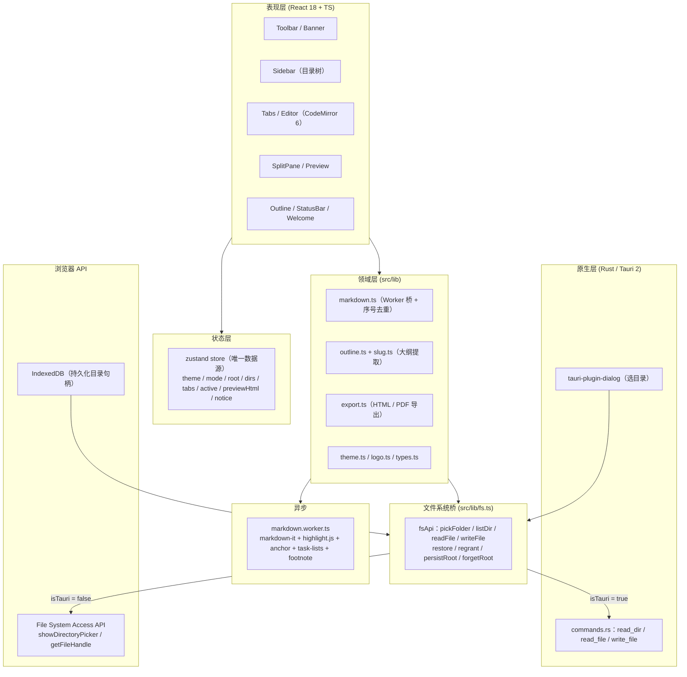
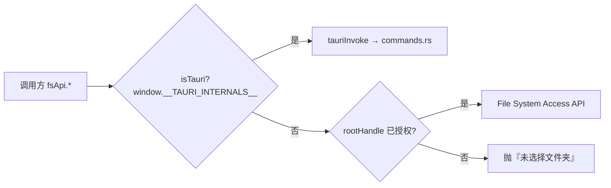
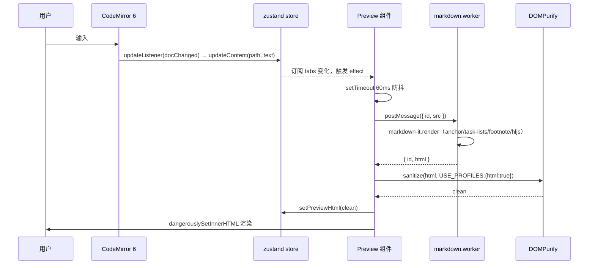
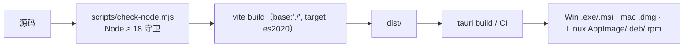
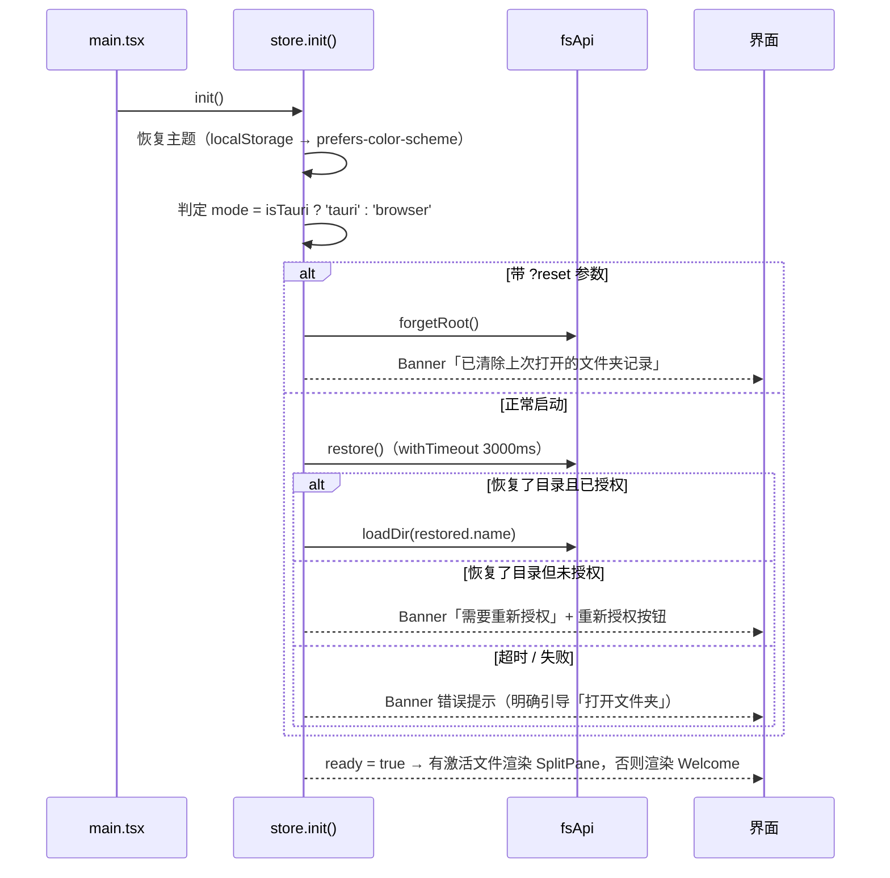

# Kore 项目设计文档

> **Kore** · 极速 · 本地 · 开源的 Markdown 编辑器
>
> 本文档描述 Kore 的产品定位、整体架构、关键模块设计、数据流与运行约束，
> 作为后续开发、重构与交接的**唯一架构基准**。

| 项 | 值 |
| --- | --- |
| 版本 | v0.1.0 |
| 仓库 | https://github.com/renxf0319/kore.git |
| 前端根目录 | `E:\WorkBuddy\2026-10-01-13-16-44\kore` |
| 文档状态 | 基于当前代码库（`d2a64fc`）实测整理，与实现一致 |
| 适用读者 | 项目维护者、参与二次开发的同学 |

---

## 1. 产品定位与设计目标

### 1.1 一句话定位

一个**只活在用户本机**的 Markdown 写作工具：左边写、右边即时渲染，文件永远落在用户选的目录里。

### 1.2 设计目标（优先级从高到低）

| 优先级 | 目标 | 落地体现 |
| --- | --- | --- |
| P0 | **零云同步** | 架构中不存在任何网络层后端；`fsApi` 只有本地读写通道 |
| P0 | **启动快、输入不卡** | Markdown 解析放 Web Worker；CodeMirror 6 取代 Monaco；Tauri 取代 Electron |
| P0 | **体积可控** | 安装包 2~3MB（Tauri + 系统 WebView） |
| P1 | **双形态同一套代码** | 桌面端（Tauri，Rust 读盘）/ 浏览器端（File System Access API），上层无感知 |
| P1 | **不静默失败** | 任何文件操作异常都经 `Banner` 显式呈现；错误文案做了中文映射 |
| P2 | **界面克制** | 单色系 + 少量强调色，左右中缝可拖，无多余面板 |

### 1.3 明确不做的事（Non-Goals）

- 不做云同步 / 多端协作 / 账号体系 —— 这是产品底线，不是待办。
- 不做富文本 WYSIWYG，编辑体验锚定 Markdown 源码。
- 不做插件系统（当前版本）。
- 不做客户端自动更新（发版靠 GitHub Actions 打 tag 出包）。

---

## 2. 总体架构

### 2.1 分层视图



### 2.2 关键架构决策（ADR 摘要）

| # | 决策 | 理由 | 被否决的方案 |
| --- | --- | --- | --- |
| ADR-1 | 用 **Tauri 2 + Rust** 而非 Electron | 安装包 2~3MB、内存低、复用系统 WebView、原生文件权限模型清晰 | Electron（体积大、冷启动慢） |
| ADR-2 | 用 **CodeMirror 6** 而非 Monaco / TinyMCE | 体积约为 Monaco 的 1/5，扩展模型（Compartment）完美适配主题切换，自带搜索/多光标/缩进 | Monaco（过重） |
| ADR-3 | Markdown 解析跑在 **Web Worker**，且主线程只持有一份预览 HTML | 大文档不卡主线程，输入不丢帧 | 主线程同步渲染（大文档掉帧） |
| ADR-4 | 文件系统访问收敛到 **单一 `fsApi` 门面**，双模式同签名 | 业务代码零环境判断，`isTauri` 只在 `fs.ts` 与状态层出现两次 | 各组件自行判断运行环境 |
| ADR-5 | 状态用 **zustand 单 store**，不做 Context + reducer | 样板极少、选择器订阅可精准重渲染；跨组件（Toolbar/Sidebar/Tabs/StatusBar）共享同一份数据 | Redux Toolkit（样板重） |
| ADR-6 | 预览渲染链路固定为 **Worker 渲染 → DOMPurify 消毒 → `dangerouslySetInnerHTML`** | 即使 `markdown-it` 开了 `html: true`，出口仍强制消毒，杜绝注入面 | 直接 innerHTML |
| ADR-7 | 双形态同一份前端产物（`base: './'`），Tauri 只做宿主 | 免维护两套 UI | 前端按平台分仓 |

---

## 3. 技术选型

| 层 | 选型 | 版本 | 理由 |
| --- | --- | --- | --- |
| 桌面运行时 | Tauri 2（Rust） | 2.x | 见 ADR-1 |
| UI 框架 | React | 18.3 | 生态最成熟 |
| 语言 | TypeScript（strict + noUnusedLocals/Parameters） | 5.6 | 类型安全，`tsc --noEmit` 进 build |
| 构建 | Vite | 5.4 | HMR 极快；`worker.format: 'es'` 支持 ES Module Worker |
| 编辑器 | CodeMirror 6（state/view/commands/lang-markdown/search/lint/theme-one-dark） | 6.x | 见 ADR-2 |
| Markdown | markdown-it（html / linkify / typographer） | 14 | 插件生态齐全 |
| 扩展 | markdown-it-anchor / task-lists / footnote | 9 / 2 / 4 | 标题锚点、任务列表、脚注 |
| 代码高亮 | highlight.js | 11 | 语言覆盖广 |
| 消毒 | DOMPurify | 3.1 | 出口统一净化（见 ADR-6） |
| 状态 | zustand | 4.5 | 见 ADR-5 |
| 图标 | lucide-react | 0.451 | 线性一致 |
| 样式 | 纯 CSS + CSS 变量（`tokens.css`） | - | 零运行时、主题切换只换 `[data-theme]` |
| 工具链约束 | Node ≥ 18（`.node-version` = 22.23.3，fnm 固定） | - | Vite 5 不支持 Node 16 |

---

## 4. 目录结构

```
kore/
├── index.html                  # 唯一 HTML 入口（#root + module script）
├── vite.config.ts              # base:'./' 适配 Tauri 自定义协议；worker.format:'es'
├── tsconfig.json / .node-version
├── dev.cmd                     # 仓库根一键启动（窗口管理器双击即可）
├── scripts/
│   ├── check-node.mjs          # Node 版本前置守卫（<18 直接退 1，给出明确提示）
│   ├── dev.cmd / dev-desktop.cmd / dev-desktop.ps1
│   ├── install-rust.ps1        # 交互式安装 Rust，默认落非 C 盘
│   ├── gen_logo.py             # 从品牌源图生成 logo 与全套应用图标
│   └── push-to-github.ps1
├── src/
│   ├── main.tsx                # initTheme() → createRoot，加载 tokens.css / global.css
│   ├── assets/                 # logo 四件套（mark/wordmark × light/dark）
│   ├── components/             # 8 个纯展示 + 容器组件
│   ├── state/store.ts          # 唯一的 zustand store（全部业务动作）
│   ├── lib/                    # fs / markdown / outline / slug / export / theme / logo / types
│   ├── workers/markdown.worker.ts
│   ├── styles/tokens.css       # 亮/暗双主题 CSS 变量
│   └── styles/global.css       # 布局 + 组件样式（含 @media print）
├── src-tauri/
│   ├── Cargo.toml              # release profile：lto + panic=abort + strip + opt-level="s"
│   ├── tauri.conf.json         # productName Kore / identifier com.kore.app / Windows 1200×800
│   ├── capabilities/default.json
│   └── src/{main.rs,lib.rs,commands.rs}
├── dist/                       # Tauri 消费的静态产物（frontendDist: ../dist）
└── .github/workflows/release.yml  # push v* 标签 → 三平台安装包 → GitHub Release
```

---

## 5. 关键模块设计

### 5.1 文件系统桥 `src/lib/fs.ts`（整个项目最核心的抽象）

这一个文件把「桌面端 Rust 读盘」和「浏览器端 File System Access API」拍成同一组接口，
上层（`store.ts`、组件、`export.ts`）只用 `fsApi`，永远不关心自己在哪个环境。



统一 API：

| 方法 | 桌面端实现 | 浏览器端实现 |
| --- | --- | --- |
| `pickFolder()` | `@tauri-apps/plugin-dialog` 的 `open({directory:true})` | `showDirectoryPicker({mode:'readwrite'})` |
| `listDir(path)` | `invoke('read_dir')` | `handle.entries()` 递归到目标目录 |
| `readFile(path)` | `invoke('read_file')` | `getFileHandle().getFile().text()` |
| `writeFile(path, content)` | `invoke('write_file')` | `createWritable()` |
| `persistRoot / restore` | `localStorage['kore-root']` | IndexedDB `kv` 对象存储存 `FileSystemDirectoryHandle` |
| `regrant / forgetRoot / hasRestoredHandle` | 空操作 / 清 localStorage | `requestPermission` / 删 IndexedDB 记录 |

#### 5.1.1 浏览器端的「虚拟路径」约定（易错点，务必遵守）

浏览器里**没有真实绝对路径**，因此统一用一条规则：

> 虚拟路径的第一段**永远是根目录的名字**（例如打开 `gateway` 目录，`gateway/技术方案.md`）。
> 解析时 `relParts()` 先把这段根名剥掉，剩下的才是相对段；生成子项时必须重新拼上根名前缀。

`src/lib/fs.ts` 的注释明确记录了这条规则的由来：生成子项时漏掉根名前缀 → 解析时按字符串长度硬切 →
展开子目录报「找不到目录」（对应提交 `d2a64fc fix(fs): 修复浏览器模式展开子目录报『找不到目录』`）。
**任何新增路径拼接逻辑都必须复用 `relParts()`，不要自己 `split('/')`。**

#### 5.1.2 权限恢复与三个逃生口

浏览器安全模型要求「重新授权」必须由**用户手势**触发，所以设计上留了三道兜底：

1. `restore()` 返回 `{ name, granted }`，`granted=false` 时不上报失败，而是交给 `Banner` 渲染一个「重新授权」按钮（`notice.action='regrant'`）。
2. `init()` 里对恢复流程套了 `withTimeout(…, 3000)`：IndexedDB 反序列化句柄卡死时**宁可不恢复也不让页面卡住**。
3. `?reset` 查询参数：`store.init()` 检测到即 `forgetRoot()` 并在 Banner 提示重选目录——当恢复流程把页面拖死、界面都点不动时的最后自救手段。

#### 5.1.3 排序规则一致

- 浏览器端：`localeCompare(name, 'zh')`，目录优先。
- Rust `read_dir`：目录优先，再 `to_lowercase()` 后按名字比较。
两端肉眼结果一致，目录树不会出现「桌面端和浏览器端顺序不同」。

### 5.2 状态层 `src/state/store.ts`

zustand 单 store，是整个应用**唯一数据源**。字段与职责：

| 字段 | 类型 | 说明 |
| --- | --- | --- |
| `theme` | `'light' \| 'dark'` | 主题；切换时同时 `applyTheme()` 写 DOM 与 localStorage |
| `mode` | `'tauri' \| 'browser' \| 'unknown'` | 运行形态，状态栏直接展示「桌面端 / 浏览器端」 |
| `rootPath / rootName` | `string \| null` | 当前根目录（桌面端是绝对路径，浏览器端是虚拟根） |
| `expanded` | `Record<string, boolean>` | 目录树展开态，key 为路径 |
| `dirs` | `Record<string, FileNode[]>` | **按需缓存**的目录列表（懒加载，只在展开时拉取） |
| `tabs` | `OpenTab[]` | `{ path, name, content, savedContent, dirty }` |
| `active` | `string \| null` | 当前激活文件路径 |
| `previewHtml` | `string` | 已消毒的当前预览 HTML，导出时直接用 |
| `ready` | `boolean` | 启动流程是否结束，决定渲染编辑器还是 Welcome |
| `notice` | `Notice \| null` | 顶部提示条，可带 `action:'regrant'` 渲染成按钮 |

动作：`init / setNotice / regrantRoot / setTheme / toggleTheme / openFolder / loadDir /
toggleExpand / openFile / closeTab / setActive / updateContent / saveActive / newFile / setPreviewHtml`。

设计要点：

- **脏标记由内容比对得出**：`updateContent` 里 `dirty = content !== savedContent`，不做额外记账。
- **错误文案本地化**：`errText()` 把浏览器的英文 `DOMException` 映射为中文（NotFoundError/NotAllowedError/
  SecurityError/TypeMismatchError/QuotaExceededError/AbortError 等共 8 类），因为直接展示 `DOMException` 对用户毫无意义。
- **取消不是错误**：`isAbort()` 判断 `AbortError`，用户在系统目录选择框里点取消时静默返回。
- **关闭标签不拦未保存**：`closeTab` 直接丢弃，不做二次确认（当前版本的有意取舍，见 §8）。
- `newFile()` 用 `untitled.md → untitled-1.md → …` 避开同名，写盘后 `loadDir(root)` 刷新目录再开标签。
- 路径分隔符按环境取：`isTauri ? '\\' : '/'`，保证虚拟路径在浏览器端不被 Windows 反斜杠切乱。

### 5.3 编辑 → 预览渲染链路



三条稳定性保证：

1. **60ms 防抖**（`Preview.tsx`）：连续输入只触发一次渲染，且 effect 清理时 `cancelled=true` + `clearTimeout`，杜绝竞态回写。
2. **Worker 过期请求丢弃**（`src/lib/markdown.ts`）：主线程维护单例 Worker + 自增 `seq`，只保留 `latest` 序号的结果，
   慢的中间结果全部丢弃 —— 飞快输入时预览**永远展示最新内容且不闪烁**。
3. **编辑器视图只按 `[active, theme]` 重建**（`Editor.tsx`）：`updateContent` 会改 `tabs`，但绝不能进依赖数组，
   否则每次按键都重建 CodeMirror 视图 → 光标跳动 + 卡顿。代码注释里明确标注了这条约束。
   主题切换走 `themeCompartment.of(oneDark / [])` 之外还重建视图，是「主题 + 文档」组合的正确性代价。

### 5.4 大纲与锚点一致性

- `extractOutline()`（`src/lib/outline.ts`）：逐行扫，用 `inFence` 状态机跳过 ``` / ~~~ 代码块内的 `#`，
  正则 `^(#{1,6})\s+(.*\S)\s*#*$` 取标题，统一剥掉行尾 `#` 并 trim。
- `slugify()`（`src/lib/slug.ts`）：`toLowerCase → 空格转 - → 只保留 `\w`、中日韩汉字、`-`。
  **兼容中文**是刻意设计：中文标题的锚点 id 带中文字符，与 `markdown-it-anchor` 通过同一函数生成，
  因此 `Outline` 的 `onClick` → `document.getElementById(id)?.scrollIntoView({behavior:'smooth'})` 与预览锚点严格对齐
  （预览面板 `.preview-pane` 是 `overflow:auto` 的滚动容器，滚动由它完成）。
  ⚠️ 若将来改锚点生成规则（如引入 `github-slugger`），必须同步改 `slug.ts`，否则大纲跳转会全部失效。

### 5.5 主题与视觉

- `tokens.css` 定义两套 CSS 变量（亮色 `--bg #ffffff` / 暗色 `--bg #1b1f27`），切换只改 `document.documentElement.dataset.theme`，零重渲染。
- `theme.ts`：`localStorage['kore-theme']` 优先，未设置时回落 `prefers-color-scheme`。
- Logo 四件套由 `scripts/gen_logo.py` 从品牌源图生成（抠底 → 用 HSV 的 value 分色藏青 #394958 / 青 #209EBB → 连通域切 K 标记 → 出图），
  `logo.ts` 按主题返回 `markSrc/wordmarkSrc`，组件只换 `src`。
- 打印样式：`global.css` 的 `@media print` 只保留预览面板，工具栏/侧栏/大纲/状态栏全部 `.no-print` 跳过；
  「导出 PDF」本质是 `window.print()` + 系统打印对话框「另存为 PDF」。

### 5.6 导出

| 方式 | 桌面端 | 浏览器端 |
| --- | --- | --- |
| 导出 HTML | 同名 `.html` **写回源文件同级目录** | `Blob + a[download]` 触发本地下载 |
| 导出 PDF | 调 `window.print()` | 同左 |

`buildHtmlDoc()` 生成自包含单文档：内嵌样式，背景/前景/代码块/引用/表格按当前主题取色，
`.anchor-link`、图片 `max-width:100%`、`h1~h3` 加 `scroll-margin-top`。导出内容取 `previewHtml`（**已消毒版本**）。

### 5.7 桌面端 Rust 侧

三个命令，全部同步阻塞式 IO，无异步、无并发（并发由 WebView 单线程 + 用户操作节奏天然串行）：

| 命令 | 实现 | 失败语义 |
| --- | --- | --- |
| `read_dir(path)` | `fs::read_dir`，跳过 `file_type()` 异常项；目录优先 + 小写名排序 | `Result<Vec<FileEntry>, String>`，错误即中文前缀文案 |
| `read_file(path)` | `fs::read_to_string` | 同上 |
| `write_file(path, contents)` | `fs::write`（覆盖） | 同上 |

- 权限面收敛在 `capabilities/default.json`：`core:default / core:event / core:window / core:app` +
  `dialog:default / dialog:allow-open`。应用自有命令默认放行，不额外声明。
- `main.rs` 用 `#![cfg_attr(not(debug_assertions), windows_subsystem = "windows")]` 屏蔽 release 窗口控制台。
- `Cargo.toml` release profile：`panic="abort"` + `lto=true` + `codegen-units=1` + `opt-level="s"` + `strip=true`，
  目标是极小的 release 体积（与「安装包 2~3MB」的产品目标对应）。
- `tauri.conf.json` 里 `csp: null` —— 当前未设 CSP（见 §8 技术债）。

### 5.8 构建与发布



- `npm run build` = `tsc --noEmit && vite build`，类型错误直接阻断产物。
- `base: './'`：产物走相对路径，才能被 Tauri 自定义协议加载。
- `worker.format: 'es'`：Markdown Worker 以 ES Module 形式拆包。
- CI（`.github/workflows/release.yml`）：`push: tags: ['v*']` 或手动触发 →
  ubuntu-22.04 / windows-latest / macos-latest 三平台矩阵 → 删掉 `package-lock.json` 后 `npm install`
  （避免单一平台 lock 固化原生 optional 依赖，npm bug #4828）→ `tauri build` → 上传 Release。
- Windows MSVC 目标需要 VS 生成工具提供 `link.exe`（外部环境依赖）；
  `scripts/install-rust.ps1` 只保证 `CARGO_HOME`/`RUSTUP_HOME` 落在非 C 盘。

### 5.9 启动流程



---

## 6. 典型数据流时序

### 6.1 首次打开一个文件夹

```
工具栏「打开文件夹」 → openFolder()
  → fsApi.pickFolder()        桌面：原生对话框 / 浏览器：showDirectoryPicker
  → 设置 rootPath/rootName、expanded[root]=true
  → fsApi.persistRoot()       桌面：localStorage / 浏览器：IndexedDB
  → loadDir(root) → fsApi.listDir() → dirs[root] = FileNode[]
  → Sidebar 渲染根目录节点 + 子节点
```

### 6.2 打开文件 → 编辑 → 保存

```
点击文件        → openFile(path, name)
                   → tabs 已有则只切 active；否则 fsApi.readFile() 后入 tab（dirty=false）
展开目录        → toggleExpand(path) → loadDir(path)（懒加载，按需）
CodeMirror 输入  → updateListener → updateContent(path, text) → dirty 自动置位
Ctrl/Cmd + S    → keymap 'Mod-s' → saveActive() → fsApi.writeFile() → savedContent=content, dirty=false
关闭标签        → closeTab()（当前不拦截未保存）
```

---

## 7. 两种运行模式对比

| 维度 | 桌面端（Tauri） | 浏览器端 |
| --- | --- | --- |
| 选目录 | 原生窗口 `tauri-plugin-dialog` | `showDirectoryPicker()`（Chrome/Edge） |
| 读盘 | Rust `fs::read_to_string` | File System Access API |
| 目录记忆 | `localStorage` | IndexedDB 存 `FileSystemDirectoryHandle` |
| 授权 | 系统级，一次选择长期有效 | 每次新页面需 `queryPermission`，用户手势 `requestPermission` 重新授权 |
| 路径形态 | 真实 Windows 绝对路径（`\`） | 虚拟路径（首段为根名，`/`） |
| 导出 HTML | 直接写回源文件同级 | Blob 下载 |
| 安装包 | 2~3MB 独立程序 | 零安装，`npm run dev` 即开 |
| 缺陷面 | 需 Rust 工具链 + MSVC 链接器 | Safari/Firefox 不支持；刷新页面需重新授权 |

---

## 8. 已知约束与技术债

按「影响面 × 修复成本」排序，供后续迭代参考：

| # | 项 | 现状 | 建议 |
| --- | --- | --- | --- |
| 1 | **关闭未保存标签无二次确认** | `closeTab` 直接丢弃 `content` | 加 `beforeunload` + 关闭前弹「保存 / 不保存 / 取消」 |
| 2 | **无自动保存 / 无崩溃恢复** | 只靠手动 `Mod+S`，进程崩溃即丢草稿 | 可选：写入前把 `savedContent` 快照放 IndexedDB，启动时提示恢复 |
| 3 | **无 CSP** | `tauri.conf.json` 里 `"csp": null` | 补 CSP 白名单（本机静态资源 + blob:），降低 WebView 注入面 |
| 4 | **目录树不自动刷新** | 外部改动文件后需手动「新建/重开」才可见 | 桌面端可接文件监听，浏览器端只能手动 `loadDir` |
| 5 | **并发/外部写覆盖** | `write_file` 无条件覆盖，无时间戳/版本号校验 | 超小型工具可接受；若要加强，可加 mtime 比对 |
| 6 | **编辑器视图随切文件重建** | 撤销历史（`history()`）不跨文件保留，滚动位置丢失 | 如要跨文件撤销，改为按 `path` 缓存多份 `EditorState` |
| 7 | **中文锚点进 URL hash** | 中文标题的 id 含中文字符 | 需分享链接时建议改 `slugify` 为拼音/哈希方案，并同步 `markdown.ts` 的 anchor 配置 |
| 8 | **大目录首屏加载** | `dirAt()` 逐层 `getDirectoryHandle`，深目录展开有轻微延迟 | 可接受；若卡顿明显可并行化 |
| 9 | **无移动端适配** | 定宽桌面布局（min 760×560） | 移动端若要做需重新设计 SplitPane 为 Tab 切换 |
| 10 | **`package-lock.json` 不跨平台** | CI 里刻意 `rm -f` 后重装 | 已是约定，勿回退 |

---

## 9. 附录 A · 常用命令速查

```cmd
:: 浏览器模式（日常迭代，秒级 HMR）
dev.cmd

:: 桌面端（验证 Rust 命令 / 原生窗口 / 打包前表现）
scripts\dev-desktop.cmd

:: 提交前自查
npm run typecheck      :: 只做类型检查，秒级
npm run build          :: tsc --noEmit + vite build
npm run preview        :: 预览 dist 产物
```

> Windows `cmd` 经典坑：`cd` 不会自动换盘。跨盘时须写 `cd /d E:\WorkBuddy\2026-10-01-13-16-44\kore`，
> 否则会报 `ENOENT ... C:\Users\E\package.json`。这也是项目在仓库根放 `dev.cmd` 的原因。

## 10. 附录 B · 关键文件索引

| 关注点 | 文件 |
| --- | --- |
| 文件系统抽象 / 路径规则 / 权限恢复 | `src/lib/fs.ts` |
| 全局状态与全部业务动作 | `src/state/store.ts` |
| Worker 桥与过期请求丢弃 | `src/lib/markdown.ts` |
| Markdown 渲染配置 | `src/workers/markdown.worker.ts` |
| 编辑器视图装配（⚠️ 依赖数组约束） | `src/components/Editor.tsx` |
| 预览防抖与消毒 | `src/components/Preview.tsx` |
| 大纲提取 | `src/lib/outline.ts` |
| 锚点 slug（改它前请先读 §5.4） | `src/lib/slug.ts` |
| 导出 HTML / PDF | `src/lib/export.ts` |
| 桌面端三个命令 | `src-tauri/src/commands.rs` |
| 桌面端权限面 | `src-tauri/capabilities/default.json` |
| 体积优化配置 | `src-tauri/Cargo.toml`（release profile） |
| 发布流水线 | `.github/workflows/release.yml` |
| 品牌资源生成 | `scripts/gen_logo.py` |
